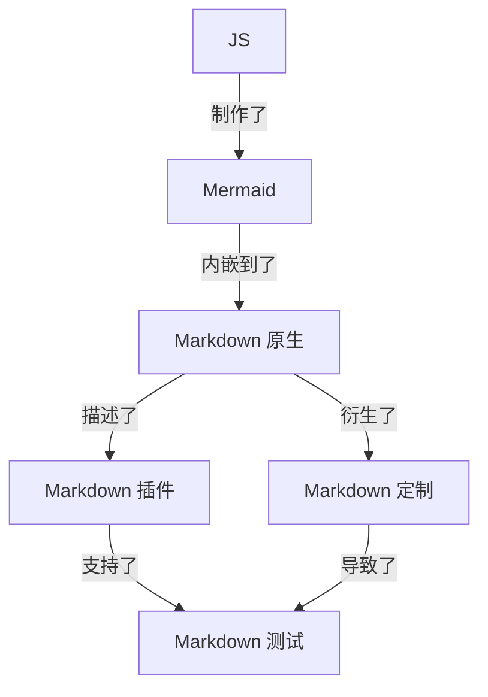
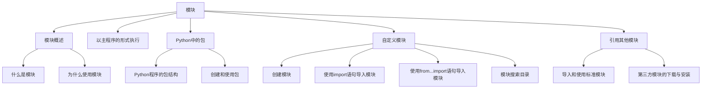

- [Test Only](#test-only)
  - [Emoji Test 2](#emoji-test-2)
    - [Title Level 3](#title-level-3)
    - [Title Level 3-2](#title-level-3-2)
  - [Title Level 2](#title-level-2)
    - [Title Level 3](#title-level-3-1)
    - [Title Level 3-2](#title-level-3-2-1)
      - [Title Level 4](#title-level-4)
  - [Title Level 2](#title-level-2-1)
    - [Title Level 3](#title-level-3-2)
    - [Title Level 3-2](#title-level-3-2-2)
      - [Title Level 4](#title-level-4-1)
  - [Title Level 2](#title-level-2-2)
    - [Title Level 3](#title-level-3-3)
    - [Title Level 3-2](#title-level-3-2-3)
      - [Title Level 4](#title-level-4-2)
  - [Title Level 2](#title-level-2-3)
    - [Title Level 3-20](#title-level-3-20)
    - [Title Level 3-21](#title-level-3-21)
      - [Title Level 4](#title-level-4-3)
  - [LLM 对齐相关实测](#llm-对齐相关实测)
    - [参数设置测试](#参数设置测试)
      - [免费版网页、App 及桌面端测试](#免费版网页app-及桌面端测试)
      - [API 测试及实际样本测试](#api-测试及实际样本测试)
    - [模糊搜索测试](#模糊搜索测试)
  - [Mermaid图显示](#mermaid图显示)
  - [代码高亮测试](#代码高亮测试)


# Test Only


## Emoji Test 2
:pill:
:bomb:
😄
:watermelon:
:bricks: &#128515;

### Title Level 3
### Title Level 3-2


<a id="innerlink1">设置案例1</a>

## Title Level 2
### Title Level 3
### Title Level 3-2


#### Title Level 4


## Title Level 2
### Title Level 3
### Title Level 3-2

#### Title Level 4
## Title Level 2
### Title Level 3
### Title Level 3-2

#### Title Level 4
## Title Level 2
### Title Level 3-20
### Title Level 3-21

#### Title Level 4
## LLM 对齐相关实测

### 参数设置测试

#### 免费版网页、App 及桌面端测试

#### API 测试及实际样本测试

### 模糊搜索测试

Name | Academy | score
:- | :-: | -:
Harry Potter | Gryffindor| 90
Hermione Granger | Gryffindor | 100
Draco Malfoy | Slytherin | 90


| Name | Academy | score |
| - | :-: | -: |
| Harry Potter | Gryffindor| 90 |
| Hermione Granger | Gryffindor | 100 |
| Draco Malfoy | Slytherin | 90 |

[案例锚点](#innerlink1)

<div style="text-align: right;">
这是右对齐的文本。（html标签操控）
</div>

<p style="text-align: right;">这是右对齐的段落2（html标签操控）。</p>


行内公式：$E=mc^2$ 

多行公式：
$$ \begin{align}
P(B|A) &= \frac{P(AB)}{P(A)} \\
P(\overline{B}|A) &= 1 - P(B|A) = 1 - \frac{P(AB)}{P(A)}
\end{align} $$

看看公示显示

## Mermaid图显示

- 流程图


- 思维导图


  
## 代码高亮测试

```python
import pyautogui
  # 获取屏幕的大小
  screen_width, screen_height = pyautogui.size()

  # 捕捉鼠标位置和点击事件的回调函数
  def on_mouse_event(event):
      print(event)

  # 注册回调函数
  pyautogui.onMouseEvent = on_mouse_event

  # 开始捕捉鼠标事件
  pyautogui.PAUSE = 0.1 # 设置每次捕捉的时间间隔
  pyautogui.FAILSAFE = True  # 如果鼠标移到屏幕的四个角，将会触发 pyautogui.FailSafeException 异常，可进行异常处理

  # 捕捉鼠标事件，直到用户按下键盘上的Ctrl+C来停止程序
  try:
      while True:
          pass
  except KeyboardInterrupt:
      pass
```

```java
// Java
class HelloWorld {
    public static void main(String[] args) {
    System.out.println("Hello, world!");
    }
}
```


```python
# Python
print("Hello, world!")
```


```ruby
    # Ruby
    puts "Hello, world!"
```


```scala
    // Scala
    object HelloWorld extends App {
    println("Hello, world!")
    }
```


```go
// Go
package main
import "fmt"
func main() {
fmt.Println("Hello, world!")
}
```
