@TOC (目录测试文档)

[TOC]

- [Test Only](#test-only)
  - [Emoji Test 2](#emoji-test-2)
    - [Title Level 3](#title-level-3)
    - [Title Level 3-2](#title-level-3-2)
  - [Title Level 2](#title-level-2)
    - [Title Level 3](#title-level-3-1)
    - [Title Level 3-2](#title-level-3-2-1)
      - [Title Level 4](#title-level-4)
  - [Title Level 2](#title-level-2-1)
    - [Title Level 3](#title-level-3-2)
    - [Title Level 3-2](#title-level-3-2-2)
      - [Title Level 4](#title-level-4-1)
  - [Title Level 2](#title-level-2-2)
    - [Title Level 3](#title-level-3-3)
    - [Title Level 3-2](#title-level-3-2-3)
      - [Title Level 4](#title-level-4-2)
  - [Title Level 2](#title-level-2-3)
    - [Title Level 3-20](#title-level-3-20)
    - [Title Level 3-21](#title-level-3-21)
      - [Title Level 4](#title-level-4-3)
  - [LLM 对齐相关实测](#llm-对齐相关实测)
    - [参数设置测试](#参数设置测试)
      - [免费版网页、App 及桌面端测试](#免费版网页app-及桌面端测试)
      - [API 测试及实际样本测试](#api-测试及实际样本测试)
    - [模糊搜索测试](#模糊搜索测试)
  - [代码高亮测试](#代码高亮测试)
- [Python](#python)
- [Ruby](#ruby)


# Test Only


## Emoji Test 2
:pill:
:bomb:
😄
:watermelon:
:bricks:


😃

### Title Level 3
### Title Level 3-2


<a id="innerlink1">设置案例1</a>

## Title Level 2
### Title Level 3
### Title Level 3-2


#### Title Level 4


## Title Level 2
### Title Level 3
### Title Level 3-2

#### Title Level 4
## Title Level 2
### Title Level 3
### Title Level 3-2

#### Title Level 4
## Title Level 2
### Title Level 3-20
### Title Level 3-21

#### Title Level 4
## LLM 对齐相关实测

### 参数设置测试

#### 免费版网页、App 及桌面端测试

#### API 测试及实际样本测试

### 模糊搜索测试

Name | Academy | score
:- | :-: | -:
Harry Potter | Gryffindor| 90
Hermione Granger | Gryffindor | 100
Draco Malfoy | Slytherin | 90


| Name | Academy | score |
| - | :-: | -: |
| Harry Potter | Gryffindor| 90 |
| Hermione Granger | Gryffindor | 100 |
| Draco Malfoy | Slytherin | 90 |

[案例锚点](#innerlink1)

<div style="text-align: right;">
这是右对齐的文本。（html标签操控）
</div>

<p style="text-align: right;">这是右对齐的段落2（html标签操控）。</p>


行内公式：$E=mc^2$ 

多行公式：
$$ \begin{align}
P(B|A) &= \frac{P(AB)}{P(A)} \\
P(\overline{B}|A) &= 1 - P(B|A) = 1 - \frac{P(AB)}{P(A)}
\end{align} $$


看看公示显示

```mermaid
flowchart TB
    A["JS"]
    B["Mermaid"]
    C["Markdown 原生"]
    D["Markdown 定制"]
    E["Markdown 插件"]
    F["Markdown 测试"]
    A --制作了--> B --内嵌到了 --> C --衍生了--> D
    C --描述了--> E
    E --支持了--> F
    D --导致了--> F
```



## 代码高亮测试

​```python

    import pyautogui

    # 获取屏幕的大小
    screen_width, screen_height = pyautogui.size()

    # 捕捉鼠标位置和点击事件的回调函数
    def on_mouse_event(event):
        print(event)

    # 注册回调函数
    pyautogui.onMouseEvent = on_mouse_event

    # 开始捕捉鼠标事件
    pyautogui.PAUSE = 0.1 # 设置每次捕捉的时间间隔
    pyautogui.FAILSAFE = True  # 如果鼠标移到屏幕的四个角，将会触发 pyautogui.FailSafeException 异常，可进行异常处理

    # 捕捉鼠标事件，直到用户按下键盘上的Ctrl+C来停止程序
    try:
        while True:
            pass
    except KeyboardInterrupt:
        pass

​```


​```java

    // Java
    class HelloWorld {
        public static void main(String[] args) {
        System.out.println("Hello, world!");
        }
    }

​```

```python

# Python
print("Hello, world!")

​```


​```ruby

# Ruby
puts "Hello, world!"

​```


​```scala

// Scala
object HelloWorld extends App {
 println("Hello, world!")
}

​```


​```go

// Go
package main
import "fmt"
func main() {
 fmt.Println("Hello, world!")
}

​```
