# Test Only

## Emoji Test 2
:pill:
:bomb:
😄
:watermelon:
:bricks:

&#128515;

### Title Level 3
### Title Level 3-2

<a id="innerlink1">设置案例1</a>

## Title Level 2
### Title Level 3
### Title Level 3-2

#### Title Level 4

## Title Level 2
### Title Level 3
### Title Level 3-2

#### Title Level 4
## Title Level 2
### Title Level 3
### Title Level 3-2

#### Title Level 4
## Title Level 2
### Title Level 3-20
### Title Level 3-21

#### Title Level 4
## LLM 对齐相关实测

### 参数设置测试

#### 免费版网页、App 及桌面端测试

#### API 测试及实际样本测试

### 模糊搜索测试

Name | Academy | score
:- | :-: | -:
Harry Potter | Gryffindor| 90
Hermione Granger | Gryffindor | 100
Draco Malfoy | Slytherin | 90

| Name | Academy | score |
| - | :-: | -: |
| Harry Potter | Gryffindor| 90 |
| Hermione Granger | Gryffindor | 100 |
| Draco Malfoy | Slytherin | 90 |

[案例锚点](#innerlink1)

这是右对齐的文本。

这是右对齐的段落2。

[TOC]

行内公式：$E=mc^2$ 

多行公式：
$$ \begin{align}
P(B|A) &= \frac{P(AB)}{P(A)} \\
P(\overline{B}|A) &= 1 - P(B|A) = 1 - \frac{P(AB)}{P(A)}
\end{align} $$

看看公示显示

```mermaid
flowchart TB
    A["JS"]
    B["Mermaid"]
    C["Markdown 原生"]
    D["Markdown 定制"]
    E["Markdown 插件"]
    F["Markdown 测试"]
    A --制作了--> B --内嵌到了 --> C --衍生了--> D
    C --描述了--> E
    E --支持了--> F
    D --导致了--> F
```

